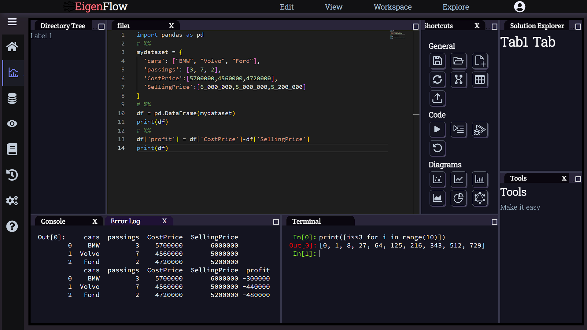

# Project EigenFlow

**An web based IDE for Data Processing and Analysis and research purpose.**

## Project information:

### *Type* :
web-based (in future cloud based) IDE for data scientists, AI developers, and other researchers  

### *Target people*: 
mainly non-coder mathematician, non-coder statisticians , all kinds of data scientists, researchers, and beginner data scientists, and beginner coders 

### Features 
#### *Basic Features* :

1. Basic code editor and execution

2. Interactive environment

3. Interactive shell 

4. Data Visualization view

5. Variable Explorer

6. Storage (cloud store, google drive, drop box etc.)

7. Data Base features (for users, Users can direct control databases using SQL commands for data handling purposes)

#### *Main Features*: 

visual script editor using data flow graph 

(Just like shader graph in blender)

#### *Additional features* :

1. Project management system

2. Team Discussion chat

3. Task scheduling with notification

4. Note taking

Not only a simple IDE along with a group or team or project management system in the same website so that multiple group or team can partially.

### Tech Stack
##### Development Tools
> 1. **React Js**
> 2. **Django Rest Framework**( Old Approach)
> 3. **FastAPI**
##### Data Analysis Tools 
> 1. Numpy 
> 2. pandas
> 3. Matplotlib
> 4. Torch
> 5. Tensorflow

### Screenshots 

